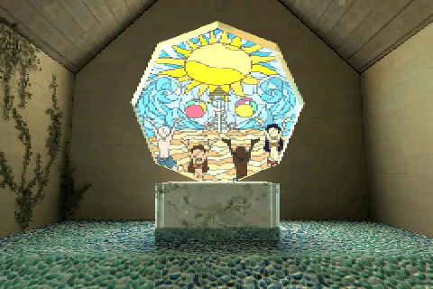
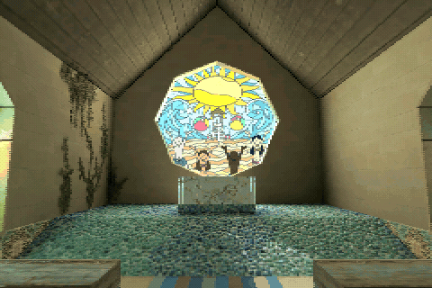

# Jet Megatextures Demo for ESP32-S3

A richly textured chapel rendered entirely in software on an **ESP32-S3**, using
[Jet](https://github.com/CubeCoders/Jet). A 90-second camera tour explores the
interior and stained glass; an optional controller lets you look around freely.

This is an ESP32 adaptation of **James D. Lambert's
[N64 megatexture demo](https://github.com/lambertjamesd/n64brew2023)**. The chapel,
its UV layout and baked artwork come from that project. James' use of tiled
textures on constrained hardware inspired this version. His
[MIT licence](LICENSE.n64brew2023) is preserved alongside
[source attribution and conversion details](esp32-streaming-chapel/generated/README.md).





These are native software captures of the ESP32 visual configuration, with the
FPS overlay hidden: **480×320 output, RGB565, half-width rendering and alternating
fields**. They are not photographs of the LCD or higher-resolution desktop
renders. The GIF is a short selection of tour passages; its playback rate is
not a hardware benchmark. [Capture details and regeneration](docs/media/README.md).

## What it demonstrates

- **Baked lighting on simple geometry:** 325 triangles across 108 surfaces, with
  the visual detail carried by 18 textured materials.
- **Paletted mipmapped textures:** a 5.01 MiB texture pack fits in PSRAM, while
  256-colour RGB565 palettes stay in faster internal RAM.
- **Perspective-correct texture mapping:** adaptive short spans reduce the cost
  of perspective division while limiting texture-coordinate error.
- **A moving cache of bilinear results:** frequently sampled UV regions are
  filtered once, then fetched as RGB565 pixels. Cold or evicted regions use
  nearest sampling immediately and become smooth as their tiles are ready.
- **ESP32 display scheduling:** two raster workers, DMA scanout and field pacing,
  sharing the runtime from [JetExamples](https://github.com/CubeCoders/JetExamples).

The full reduced source pack is resident in PSRAM in the default configuration.
This is **not yet an out-of-core demo of a scene larger than RAM**. The original
source-tile cache remains available for experiments, but is disabled because it
did not materially improve this scene's measured performance. The separate
prefiltered hot cache is enabled and is responsible for the smoothing speedup.

## Build and run

Use **ESP-IDF 6.0.x** (tested with **6.0.1**), Git, and an ESP32-S3 with
**16 MiB flash and 8 MiB PSRAM**. Open an ESP-IDF terminal with its compiler and
Python environment active. Review the board settings below before flashing.

```sh
git clone --recurse-submodules https://github.com/CubeCoders/JetMegatexturesDemo.git
cd JetMegatexturesDemo/esp32-streaming-chapel

idf.py -B build-s3 "-DIDF_TARGET=esp32s3" "-DSDKCONFIG=sdkconfig.s3" build
idf.py -B build-s3 "-DIDF_TARGET=esp32s3" "-DSDKCONFIG=sdkconfig.s3" -p PORT flash monitor
```

Replace `PORT` with your serial port, such as `COM6` or `/dev/ttyACM0`.
Exit the monitor with **Ctrl+]**. The automatic tour starts without buttons.
Generated assets are checked in: ordinary builds do not need Blender, Pillow,
NumPy, Git LFS or the original N64 build tools.

If you cloned without dependencies, run `git submodule update --init --recursive`
from the repository root. Use the pinned revisions: Jet includes the tiled
sampler and span support this project needs, and LovyanGFX uses CubeCoders' DMA
optimizations. Keep `components`, `cmake` and the IDF project in this layout.

### Configure your board and LCD

**Test hardware:** dual-core ESP32-S3 at **240 MHz**, **8 MiB octal PSRAM at
80 MHz**, **16 MiB flash**, and a **320×480 ST7796 SPI LCD at 80 MHz**, rotated to
480×320 landscape. This demo's hardware validation is for S3; the shared runtime
contains P4 code but this project does not ship a tested P4 configuration.

Change the LovyanGFX setup in
[`components/esp32_jet/Board.hpp`](components/esp32_jet/Board.hpp), rather than
editing the display library itself.

| Setting | Where to change it |
| --- | --- |
| SCLK, MOSI, D/C, CS, reset, backlight | `Board::clock`, `mosi`, `dc`, `cs`, `reset`, `backlight` |
| SPI frequency and mode | `b.freq_write`, `b.freq_read`, `Board::spiMode` |
| Display controller | `lgfx::Panel_ST7796`; choose your panel's LovyanGFX class |
| Dimensions, offsets, inversion, RGB/BGR | The `panel.config()` block |
| Backlight polarity/PWM | The `light.config()` block |
| Landscape orientation | `tft.setRotation(3)` in `components/esp32_jet/Display.cpp` |
| Output resolution | `SCREEN_WIDTH/HEIGHT` in `Display.hpp`, plus scene/projection assumptions |
| CPU clock, flash size, PSRAM type/speed | `sdkconfig.defaults*`, or `idf.py ... menuconfig` |

Reference S3 wiring is **SCLK 46, MOSI 3, D/C 8, CS 17, reset 18, backlight 9**,
with no MISO and **SPI mode 1**. These pins are specific to our board. Connect
power and ground to suit your display module. The fast S3 scanout owns a
**dedicated SPI2 bus and its DMA completion interrupt**; do not share that bus
with touch, an SD card or another display task. Another SPI peripheral or a
parallel/RGB/DSI panel requires adapting scanout as well as the panel setup.

**Slower displays will not deliver the same performance.** At this resolution,
60 alternating fields/s require almost 74 Mbit/s of pixel data before commands;
a 40 MHz SPI link cannot sustain that cadence. Select a clock your LCD and wiring
actually support. The scene, viewport and buffers assume 480×320, so changing the
panel dimensions alone is not enough to change resolution.

```sh
idf.py -B build-s3 "-DIDF_TARGET=esp32s3" "-DSDKCONFIG=sdkconfig.s3" menuconfig
```

Generated `sdkconfig.s3` overrides defaults; editing `sdkconfig.defaults*` after
configuration will not replace existing settings. The supplied single-app
partition layout uses the full **16 MiB flash** and has no OTA slot. An 8 MiB
flash board needs a smaller partition layout and the correct flash setting;
boards with less PSRAM need a different residency/cache budget. Those variants
have not been hardware-tested. Firmware is approximately 5.4 MiB.

### Optional camera controls

The tour works without any input hardware. `CHAPEL_BUTTONS` defaults to `OFF`,
so the demo does not drive the reference controller pins. Enable it only for the
matching shift-register circuit, or adapt
[`main/BoardInput.hpp`](esp32-streaming-chapel/main/BoardInput.hpp) to your controls:

```sh
idf.py -B build-s3 "-DIDF_TARGET=esp32s3" "-DSDKCONFIG=sdkconfig.s3" -DCHAPEL_BUTTONS=ON build
```

The reference scan uses latch GPIO20, clock GPIO19, data output GPIO47 and
button input GPIO21 with pulldown, scanning eight one-hot positions. These are
**not direct GPIO button inputs**. The first seven bits map to Left, Forward,
Backward, Right, Fast, Look and Height; the eighth is unused.

| Input | Action |
| --- | --- |
| D-pad up/down | Forward/backward |
| D-pad left/right | Turn |
| Hold Look + up/down | Look up/down |
| Hold Look + left/right | Strafe |
| Hold Height + up/down | Rise/lower |
| Hold Height + left/right | Strafe |
| Hold Fast | Faster movement |
| Forward + backward together | Return to the automatic tour |

Any input takes over at the current camera pose. The return chord blends back
into the paused tour. This is an inspection camera with outer bounds, not player
physics or collision against every furnishing.

## Rendering, memory and performance

Normal settings are `CHAPEL_HOT_FILTER=ON`, `CHAPEL_PSRAM_BACKING=ON`,
`CHAPEL_USE_CACHE=OFF`, with all benchmark flags off. Painter groups from the
source scene replace a depth buffer. Lighting is baked; runtime materials are
unlit. Two 240×160 RGB565 field buffers consume 153,600 bytes. At **60 fields/s**,
each individual LCD row refreshes at **30 Hz**. The small on-screen number reports
field cadence, not complete progressive frames.

The hot cache has **128 slots / 1 MiB of RGB565 samples**. Each slot covers a
64×64 region of a material/mip's 1024×1024 integer UV domain. Workers record
sampled demand independently. Between completed renders, the application fills
and replaces tiles under a soft **1 ms update budget**. Partial tiles stay hidden.
Hits match the current bilinear sampler exactly; misses use nearest. All cache
allocations occur at startup, avoiding runtime allocation churn. Textures and
palettes are immutable here; changing them would require invalidation.

On the tested S3, two full 90-second tours reported **32.6–60.0 fields/s**, with
close window passes reaching **60 fields/s and 100% sampled cache hits**. Free
memory stayed at **34,243 bytes internal RAM and 1,858,852 bytes PSRAM** after
warmup, with no logged panic, watchdog or heap-corruption errors. The pool plus
metadata allocates 1,084,416 bytes PSRAM and 8,216 bytes internal feedback storage.
The largest recorded cache update was 3.239 ms: the budget is a target, not a hard
deadline. Hit percentages describe short sampled windows, not a tour average.

For context, the same tour with live bilinear filtering reported **22.6–40.0
fields/s**; nearest reported **39.2–60.0**. Different moving-camera captures are
not a matched microbenchmark. A separate fixed-view test found exact prefiltered
bilinear reduced close-window update/render work from about **26 ms to 9–11 ms**,
with identical image hashes. [Validation details](docs/VALIDATION.md).

Turn `CHAPEL_HOT_FILTER=OFF` before enabling any fixed benchmark. Available
switches in `main/CMakeLists.txt` cover nearest/bilinear/three-point comparisons,
flash versus PSRAM, the original source-tile cache, and a fixed 2 MiB prefilter
proof. Without hot filtering, `Chapel::defaultFilter` selects three-point;
`Chapel::setFilter` can select nearest or ordinary bilinear. This tiled API and
the application-managed cache are experimental, not a general asset-streaming
system for arbitrary mutable textures.

## Host tests and media

Use CMake and a C++17 compiler (an MSVC developer prompt on Windows):

```sh
cmake -S esp32-streaming-chapel/tests -B build-native -DCMAKE_BUILD_TYPE=Release
cmake --build build-native --config Release
ctest --test-dir build-native -C Release --output-on-failure
```

Tests cover palette sampling, filtering, cache publication/eviction, perspective
error, camera controls, framebuffer guards and serial/parallel rendering parity.
The [media instructions](docs/media/README.md) describe the native capture tool.

## Regenerating the assets

This is optional. The original project is fetched only for regeneration; it is
not required by the firmware build. From this repository's root:

```sh
git clone https://github.com/lambertjamesd/n64brew2023.git upstream
git -C upstream checkout 8841ddf3e7d591af17287391f4b3b8728064c7bf
python -m pip install numpy Pillow
blender --background --factory-startup --disable-autoexec --python esp32-streaming-chapel/tools/export_scene.py
python esp32-streaming-chapel/tools/pack_assets.py
```

The conversion was validated with Blender 4.4.3. The exporter disables embedded
script execution and reads the pinned scene. The asset manifest retains source
hashes; conversion changes are described in [asset provenance](esp32-streaming-chapel/generated/README.md).
Different image-library versions can change quantization results; the checked-in
pack is the reference used for the measurements.

## Licence and acknowledgements

CubeCoders' example code is **[MIT](LICENSE)**. **James D. Lambert's original
chapel and textures retain [his MIT notice](LICENSE.n64brew2023)**, including
when redistributed in converted form or pictured in this README. Please credit
and visit [the original N64 project](https://github.com/lambertjamesd/n64brew2023).

Jet and LovyanGFX retain their licences in their pinned submodules. See
[THIRD_PARTY_NOTICES.md](THIRD_PARTY_NOTICES.md) for the complete attribution map.
The original project's audio and N64 binaries are not included.
